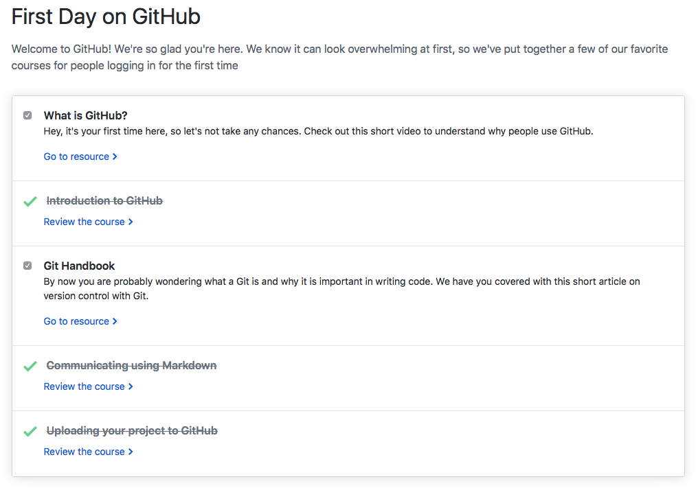
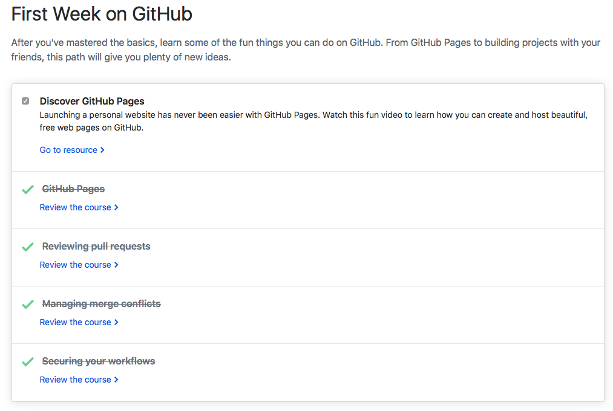
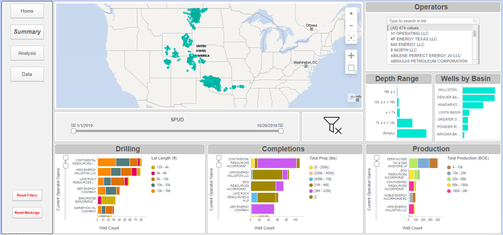
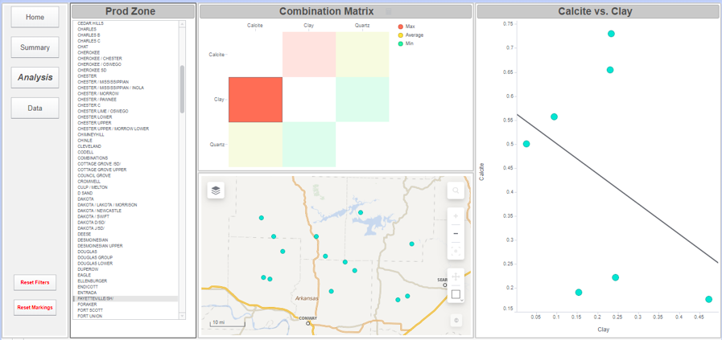
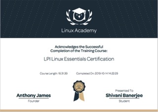
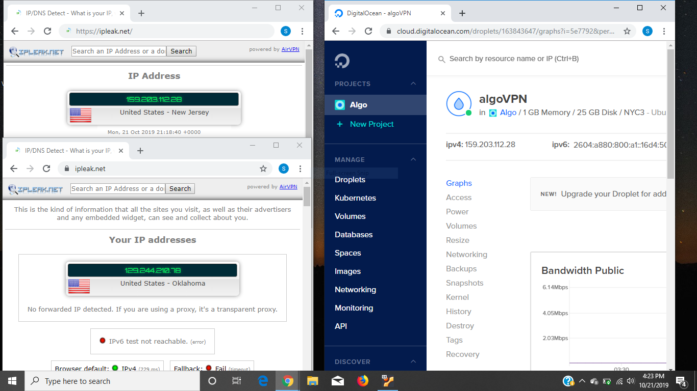
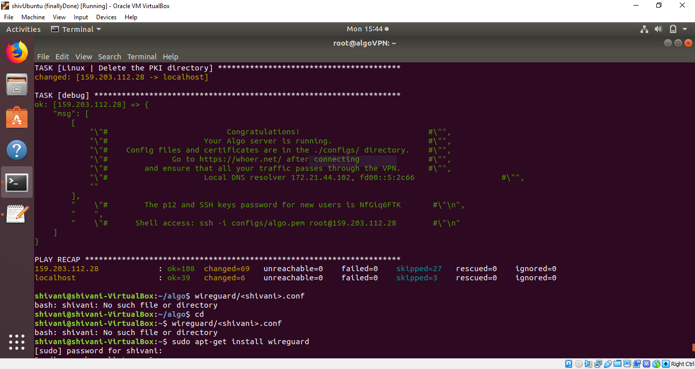

<h1> Shivani Banerjee's Technical Skills Resume </h1>

<h2> Welcome to my technical resume on GitHub. This repository displays the technical skills I have acquired. </h2>

The following are the skills that I have acquired throughout the semester:

 Github

     <ul>
          <b>First Day on GitHub</b>
          <li>Introduction to GitHub</li>
          <li>Communicating using Markdown</li>
          <li>Uploading your project on GitHub</li>

In summary, this course has taught me how to navigate around GitHub. The navigation was focused on uploading projects/ files with data that was on my local desktop.

           
          
           
          <b>First Week on GitHub</b>
          <li>GitHub Pages</li>
          <li>Reviewing pull requests</li>
          <li>Managing merge conflicts</li>
          <li>Securing your workflows</li>

In summary, this course has taught me how to utilize uploading a project onto GitHub in a systematic manner. This is useful because I learned how to maximize my learning by using pull requests to see the changes I have made in the duration of my project. This is also useful for others to view my learning curve when viewing my projects.

           
          
     </ul>
  

  

TIBCO Spotfire

     <ul>
          <b>Well Analysis Dashboard</b>
          <li>Able to import data</li>
          <li>Able to script ironPython for advanced abilities</li>
          <li>Able to create visualizations to easily aggregate data</li>

I was introduced to TIBCO Spotfire at the start of my summer internship in 2019. With no prior experience, I was able to create a dashboard, to fit a clients needs. Using those skills, I was able to create another dashbaord using public data available on IHS Markit. To view a video I created to describe my dashboard, please click <a href="https://youtu.be/XMkqa9U6uO0">here.</a>

           
          
          
          
   </ul>
  

  

Linux

     <ul>
          <b>LinuxAcademy LPI Linux Certification</b>
          <li>Linux and open-source operating systems</li>
          <li>Navigating around Linux</li>
          <li>Security and file permissions</li>

This course was a 16-hour path towards learning the foundation of understanding and utilizing Linux. Not only did it teach me the importance and growth Linux is impacting with many businesses, but also how to use Linux for personal repositories. Understanding the command line will be an ongoing process but the course is very rewarding with many challenging labs (e.g. finding and searching for hardware information, or specific data in files, etc).

           
          
   </ul>
  

    

Algo VPN

     <ul>
          <b>Using linux for creating an Algo VPN</b>
          <li>Downloaded VirtualBox to test my Linux knowledge</li>
          <li>Downloaded Ubuntu and connected and installed it onto Virtual Bpox</li>
          <li>Created a VPN network with usernames and passwords</li>

The point of this excersise was to challenging but useful to learn how to make my own VPN using DigitalOcean and a linux system. Whilst utilizing Ubuntu when installed into virtual box, I was able to share files from my host device (my laptop) to my virtual disk. Additionally, I created my own Algo VPN that, with my DigitalOcean supported IP network, to verify the connection. 

          
          
          
   </ul>
  

