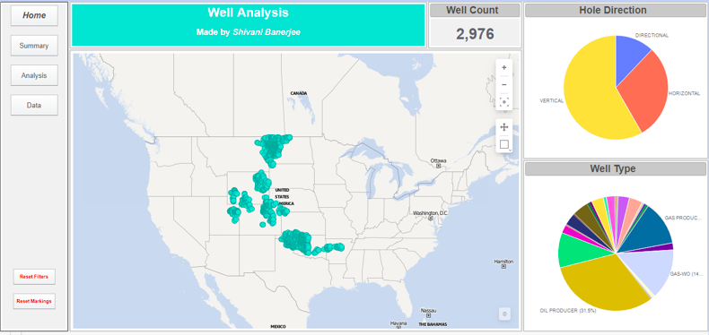
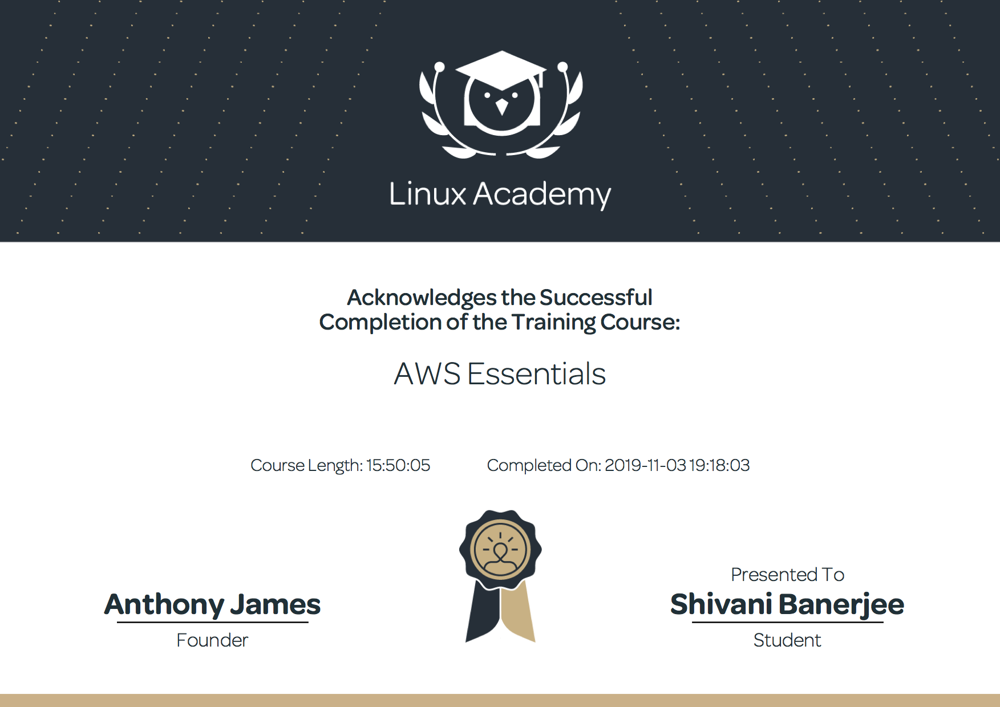

<h1> Shivani Banerjee's Technical Skills Resume </h1>

<h2> Welcome to my technical resume on GitHub. </h2>

This repository displays the technical skills I have learned throughout the last few months. 

Github

     <ul>
          <b>First Day on GitHub</b>
          <li>Introduction to GitHub and its uses</li>
          <li>Communicating using Markdown</li>
          <li>Uploading your project on GitHub</li>

In summary, this course has taught me how to navigate around GitHub. The navigation was focused on uploading files with data that was on my local desktop. Furthermore, it taught me how to communicate with other users to do group projects that are shared as well as utilizing my own text formatting. More information on this course can be found <a href="https://lab.github.com/githubtraining/paths/first-day-on-github">here.</a> 

           
          
           
          <b>First Week on GitHub</b>
          <li>GitHub Pages</li>
          <li>Reviewing pull requests</li>
          <li>Managing merge conflicts</li>
          <li>Securing your workflows</li>

In summary, this course has taught me how to utilize uploading a project onto GitHub in a systematic manner. This is useful because I learned how maximize my utility within my projects by using pull requests to see the on going progress. Additionally, I now know how to use Github to be more efficient with unique workflows - both business and personal wise. This is also useful for others to view my learning curve when viewing my projects - in an organized secure manner. Through personalizing my pages I can create an online database to store all my files where others can benefit from too. The course is further detailed when clicked <a href="https://lab.github.com/githubtraining/paths/first-week-on-github">here.</a>

           
          
     </ul>
  

  

TIBCO Spotfire Cloud

     <ul>
          <b>Well Analysis Dashboard</b>
          <li>Import multiple tables from multiple sources</li>
          <li>Able to script ironPython for advanced abilities</li>
          <li>Able to create visualizations to easily aggregate data</li>

I was introduced to TIBCO Spotfire at the start of my summer internship in 2019. With no prior experience, I was able to create a dashboard template that would benefit multiple clients. Using those skills, I was able to create another dashbaord using public data available on IHS Markit. The data source in this instance is a flat file from Excel. The reason why I built a dashbaord on Spotfire was because I was able to pull out the specific data I wanted without going through millions of values in a table. In the video, I was able to take only 2 columns to visually locate where different wells are on a map - all within one click of a button. To see a demo of my dashboard, please click <a href="https://youtu.be/XMkqa9U6uO0">here.</a>

           
          
          
          
   </ul>
  

  

Linux

     <ul>
          <b>LinuxAcademy LPI Linux Certification</b>
          <li>Linux and open-source operating systems</li>
          <li>Navigating around Linux</li>
          <li>Security and file permissions</li>

This course was a 16-hour path towards learning the foundation of understanding and utilizing Linux. Not only did it teach me the importance and growth Linux is impacting with many businesses, but also how to use Linux for personal repositories. Understanding the command line facinated me to learn how to engage with my host device (personal laptop) to be of further use. The labs provided through the course included, but wasn't limited to, finding and searching for hardware information, looking for specific data in files or managing libraries on my desktop. I went ahead and challenged my Linux skills to help a Schlumberger employee to download multiple versions of different softwares (e.g. Petrel, Studio) to help him save space on his laptop, but still remain access to all his past projects.

           
          
           
          <b>Algo VPN using Digital Ocean</b>
          <li>Use Linux on Oracle's VirtualBox</li>
          <li>Connect Ubuntu with Oracle's VirtualBox</li>
          <li>Created a VPN network using DigitalOcean</li>

The following pictures prove my sucess in configuring my own Algo VPN using DigitalOcean. This Linux system not only allowed me to create a virtual disk image on a Linux system, but also share files within my personal laptop and my virtual disk. Through creating my own cloud on DigitalOcean, I deploed my own Algo VPN server.Self-hosting this VPN taught me how to deploy my own private key as well.  Thus, I created a safe environment for my own network use.

          
          
          
   </ul>
  

   

Amazon Web Services (AWS)

     <ul>
          <b>LinuxAcademy AWS Essentials Certification</b>
          <li>Mavigate around the AWS console</li>
          <li>Manage access to roles, groups and users</li>
          <li>Utilize the different services AWS has to offer</li>

This course was a 15-hour path towards learning the foundation of understanding and utilizing AWS. With no prior experience with using AWS, I have completed the classes, hands-on-labs and multiple quizzes to test my ability of creating and managing Database services, Storage services, and Instances. Additionally, I now understand how to manage notifications, CloudWatch and Lambda with emphasise to Route 53 and auto scaling.

           
          
           
          <b>VPNs using AWS</b>
          <li>Created an E2 AWS console</li>
          <li>Created a Virtual Private CLoud with Internet Gateways</li>
          <li>Utilized IAM (Identity and Access Management)</li>

Simlarly to the ALgo VPN I created using DigitalOcean, I was able to create my own Algo VPN Server, and deploy it in the AWS cloud host. However, this time I did this in two different ways. The first way was very similar to how I deployed my own Algo VPN server onto the DigitalOcean cloud, however this time I deployed it on an AWS cloud. Additionally, the other way I created my second personal VPN was by using an EC2 instance and an OpenVPN. After configuring my EC2 instance, creating security groups and creating an elastic IP I was able to disable public access to the VPN allowing only the users I created to use the private, safe network.

          
          
          
          
   </ul>
  

   

Powershell

     <ul>
          <b>Powershell 5 Essentials Course</b>
          <li>Using basic and complex commands</li>
          <li>Exploring automation</li>
          <li>Able to create visualizations to easily aggregate data</li>

This course allowed me to not only understand what Powershell is, but also the basic navigations and capabilities. This course was provided on LinkedIn Leaning and assisted me with labs and assignments to master simple navigation and utilizing the actual software like the help system, snap-ins and remote management. 

           
          
   </ul>
  

   

Salesforce

     <ul>
          <b>Trailhead Salesforce Admin Beginner Course</b>
          <li>Data modeling, management and aggregation</li>
          <li>Working in favor of client preferences</li>
          <li>Understand and make use of lightening experience</li>

This interactive course consisted of labs and quizzes to help me master the Salesforce Platform. With only ever migrating data from Salesforce onto Spotfire, it was very interesting to know how to create dashboards with visual analytics within the platform itself. Furthermore, I was able to take advantage of the basic feautures of Salesforce and customize them from an Admin standpoint. I was able to work through the challenges to customize the desktop AND mobile templates to include advanced features such as quick action buttons, dynamic help menus, personable reports from data that I imported and/ or exported to/ from the Salesforce system.

           
          
   </ul>
  

